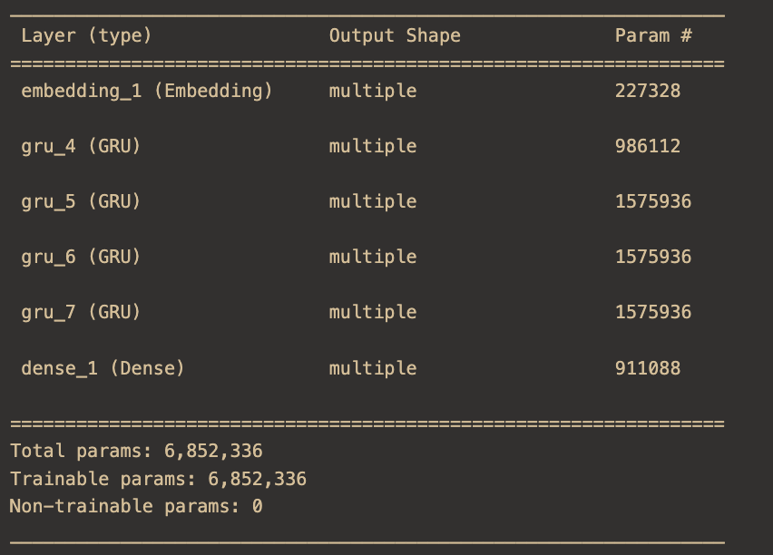
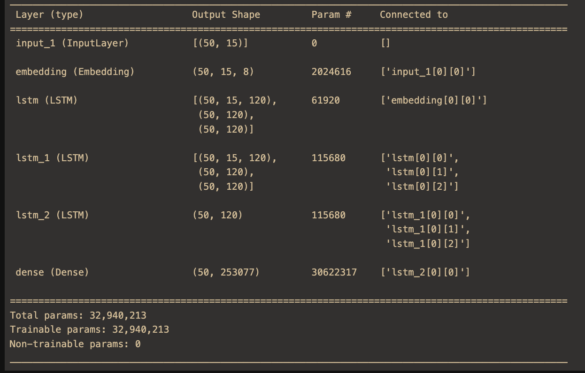

## Generación de Textos en Lenguaje Natural

### Resume

Derivado de un trabajo planteado por el curso optativo de Periodismo de Datos del profesor Yudivián Almeida de la Universidad de la Habana sobre el lenguaje digital cubano, surgió la idea que crear un modelo de Machine Learning que fuera capaz de expresarse en un lenguaje natural impregnado del estilo de la sociedad cubana al expresarse en las distintas redes sociales. Dada dicha necesidad se desarrollo una larga investigación para estudiar las distintas formas de resolver este problema y las distintas posibilidades que brindan cada una de las distintas soluciones.

### Introducción

Según [1] el español es hablado principalmente en España e Hispanoamérica, como también entre las comunidades de hispanohablantes residentes en otros países, destacando Estados Unidos con más de 40 millones de hablantes de español. Dicho idioma con el paso del tiempo y la intensa mezcla cultural, en cada una de las localizaciones mencionadas, a experimentado diversas alteraciones que han terminando caracterizando los distintos "lenguajes" dentro de la comunidad hispanohablante. Debido a las diferencias existentes entre los distintos grupos que representan al que es un de los idiomas más hablados en el mundo, el estudio de los detalles y características de cada uno de estos "subideomas" es muy interesante para muchas investigaciones en los campos como la Recuperación de Información y el Procesamiento de Lenguaje Natural, sobre todo cuando el resultado que se busca tiene el objetivo de impactar a las personas pertenecientes a un grupo específico de la comunidad hispana. En este caso particular el objetivo es lograr un bot que sea capaz de mezclarse en la sociedad digital cubana, de forma tal que pueda generar opiniones sobre diversos temas y que los miembros de este subgrupo de los hispanohablantes realizando el análisis más crítico posible no sean capaces de distinguir entre opiniones reales y textos autogenerados.

Para dar solución a dicha problemática se puede encontrar un modelo de Machine Learning que puede aprender a "expresarse" tras estudiar un gran corpus de textos de la comunidad objetivo. Para encontrar la mejor solución o una aproximación a esta, inicialmente se debe realizar un amplio procesos de investigación, desarrollo y selección de modelos, entre las principales soluciones planteadas en el estado del arte de `NLG(Natural Language Generation)`. Para finalmente seleccionar y optimizar el modelo que más pueda aproximarse al los requerimientos del problema.

### NLG(Natural Language Generation)

Según [1] La generación de lenguaje natural (NLG) es un proceso de software que produce la salida del lenguaje natural, NLG se caracteriza como "el subcampo de la inteligencia artificial y la lingüística computacional que se ocupa de la construcción de sistemas informáticos que pueden producir textos comprensibles en inglés u otros idiomas humanos a partir de alguna representación no lingüística subyacente de la información. Para resolver el problema principal de la generación de lenguaje natural existen varios enfoques y técnicas, pero las más frecuentes y las que fueron tomadas en cuenta en el proceso investigación son los enfoques supervisados, donde las técnicas más usadas son las redes neuronales `(Neurnal Network NN)` principalmente las recurrentes `RNN`, y los enfoques no supervisados, caso representado por algoritmos fundamentados en las teorías de la probabilidades y la visión frecuentista de las misma. En el proceso de investigación luego de tokenizar todo el dataset se desarrollaron y estudiaron posibles soluciones en ambos enfoques

#### Enfoque Supervisado (Neurnal Network) [github repo](https://github.com/cuban-digital-language/nlp-rnn-text-generator)

Dentro del enfoque supervisado con redes neuronales existe otro conjunto de subenfoques para la solución del problema, dichos subenfoques esta relacionados con la forma en que los textos sera generados, palabra por palabra, "de un solo golpe", etc. La investigación fue centrada en las técnicas palabra a palabra con redes neuronales recurrentes, embbedings, entre otras herramientas del sector. Los desarrollos finales estuvieron compuestos por dos modelos principales, de los cuales se muestra a continuación sus respectivas definiciones gracias a las herramientas de tensorflow.

 

Los resultados obtenidos en este enfoque no fueron muy satisfactorio a nivel de resultados, las redes neuronales son una tecnología extremadamente demandante y oscuras (en el sentido de que para generar ideas y llevarlas a capo mediante redes neuronales se necesita mucho conocimiento de la teoría, tecnologías y frameworks). Aunque la dimension del dataset pudiera ser "ideal" para una red neuronal, la ausencia de poder de computo en el equipo de investigación supuso una barrera para el adecuado estudio de las posibilidades de este enfoque.

#### Enfoque No Supervisado (Técnicas Probabilísticas) [github repo](https://github.com/cuban-digital-language/nlp-probabilistic-text-generator)

A diferencia del enfoque de redes neuronales, el enfoque no supervisado no se encuentra atado a un framework o a algún algoritmo determinado, este enfoque esta constituido por una serie de tips e ideas a seguir, pero el desarrollo y la forma de uso de las distintas ideas básicas quedan a disposición de la creatividad del investigador, cosa que en muchos casos es muy favorable pues la curva de aprendizaje no se torna tan empinada. En este caso particular el modelo esta formado por una cadena de Markov, que no se más que un autómata finito probabilístico. En este caso particular se construye como un grafo dirigido donde cada nodo representa una término reconocido en el dataset y dos nodos A y B están conectados si y solo si en alguna ocasión en el dataset uno es sucesor del otro o viceversa, la ponderación de las aristas A-B corresponde a la cantidad de veces que B es sucesor de A, análogamente para la arista B-A. Dicho grafo se construye con una iteración lineal sobre la lista de términos secuenciales del dataset. Partiendo de este autómata la generar una oración seria tan sencillo como maestrear un recorrido por el autómata desde un estado inicial hasta otro final, como puede ser el nodo punto, pero este proceso presenta varias dificultades semánticas.

Primero, el proceso antes descrito en principio denegaría una oración que hable de cualquiera de los temas que abarca el dataset, pero lo ideal sería tener una forma de como inducir el tema del texto generado. Para resolver este problema podemos modificar la estructura del autómata y la forma de recorrer el mismo, para que dicho grafo no solo cuente con conexiones del tipo A es sucesor de B sino que también registre las conexiones de B es predecesor de A, de esta manera podemos comenzar el recorrido parado desde cualquier nodo, en particular alguna palabra significativa para el tema objetivo, y recorrer el autómata hasta encontrar nodos iniciales y finales respectivamente. Luego, las cadenas de Markov parte de la hipótesis de que para la construcción de la cadena final en cada paso solo es importante el paso previo, lo cual en las estructuras oracionales no es cierta, esta característica provoca tanto problemas de estructura oracional como de divergencia de los temas dentro de una mismo oración, pues una vez que el autómata cae en un estado relacionado con algún _stop word_, símbolo de puntuación o similar no hay forma de garantizar la constancia del tema principal pues dichos nodos presenta un _branching factor_ muy elevado por aparecer en la mayoría de los textos. Para resolver estos problemas en las ideas más empleadas son optimizaciones sobre el tamaño de la cantidad de opciones a tener en cuenta en cada paso, filtrando las posibilidades por una cantidad fija o un por ciento de la probabilidad total por ejemplo, en este caso se emplean ambas sumadas a otras técnicas que intentan resolver el problema de que cada paso solo dependa del anterior. Para dar respuesta a este ultimo inconveniente se implementaron otras dos optimizaciones, primero en el proceso de entrenamiento no solo se construye el autómata del lenguaje sino que además se construye un segundo autómata en los que solo se tiene en cuenta la posición de cada palabra en la estructura oracional (sustantivo, adjetivo, complemento, ...) y una matriz de correlación oracional, donde se almacena la cantidad de veces que dos términos cuales quiera del dataset aparecen uno antes que otro en la misma oración indistintamente de la distancia entre ellas. La matriz se emplea en el momento de escoger los distintos nuevos estados del autómata, dada una n cantidad de selecciones anteriores se crea una lista de las palabras más relacionadas con las palabras ya seleccionadas y se ordena según su grado de correlación, dicha lista se filtra a partir de un valor prefijado y los términos resultantes son los únicos tenidos en cuenta en el resto de las optimizaciones siguientes. Finalmente con el automata de estructuras oracionales se muestrea una estructura a partir de una selección a la asar entre las distintas formas en las que aparece la palabra clave en el dataset, a partir de la estructura oracional generada el problema de generación de texto pasa de ser un problema de generación en un espacio probabilístico a un problemas de satisfacción de restricciones dentro del mismo espacio, este subproblema de búsqueda los resolvemos con un `Monte Carlo Tree Search`

### Conclusiones
